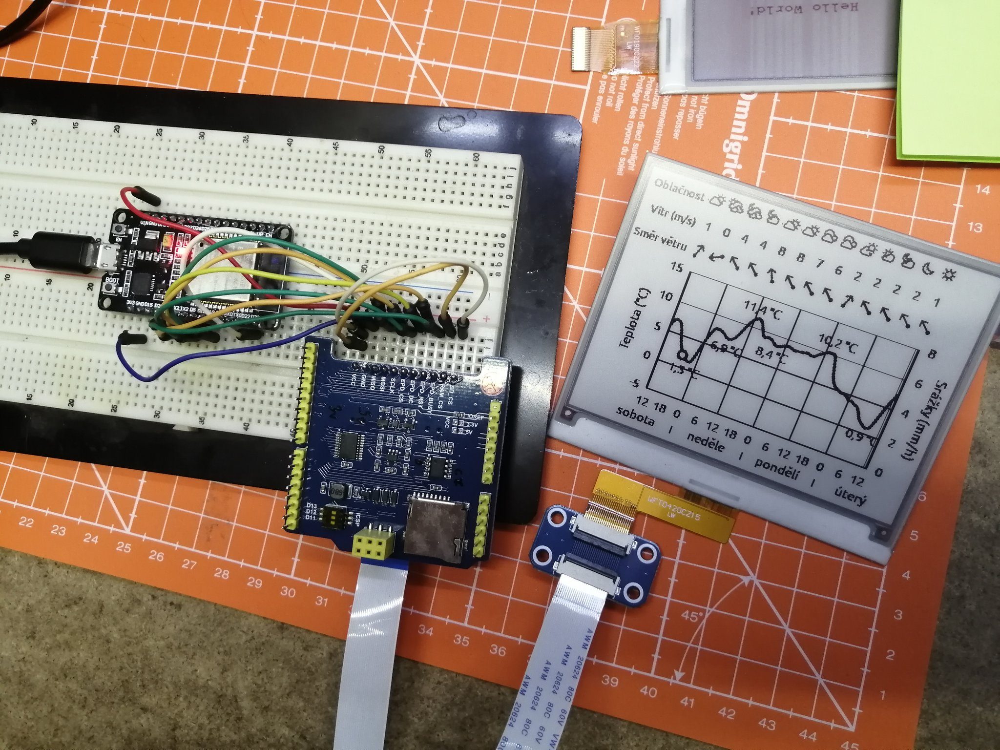

# ESP32 e-paper network display

With this project you can create ESP32 WiFi + Waveshare e-paper network display. With Python script you can send image or using Selenium the whole webpage. Python tool has also simple `YAML` configuration for configuration of each display and parameters.

https://twitter.com/hubmartin/status/1337819964238127116
https://twitter.com/hubmartin/status/1335517146256957440



# Info

Based on project by https://github.com/danielkucera/esp8266-epaper

This code was ported to ESP32 with these features:

- ESP32 DEVKIT V1
- WaveShare E-Paper ESP32 Driver Board
- WifiManager
- Waveshare 2.7" black-red-white 3 color e-paper
- Waveshare 4.2" black-red-white 3 color e-paper
- Waveshare 7.5" black-white e-paper

Work in progress:
- OTA
- Low power
- Make the transfer initialization the opposite way - The ESP wakes up in 15 minutes from low power, connects to the server IP sending info which display, resolution and colors it has. It can also add its sensor values. Then the server renders image, could add values from the sensor itself.

# Known issues

- With 7.5" epaper there are some firmware issues. The code freezes after few redraws. Could be some RAM/stack issue, do not have time to investigate now.

# Needed packages and tools

- Selenium browser and chrome driver. [Windows instructions](https://medium.com/@patrick.yoho11/installing-selenium-and-chromedriver-on-windows-e02202ac2b08), [Linux instructions](https://tecadmin.net/setup-selenium-chromedriver-on-ubuntu/)
- If you use 3 color display you have to install ImageMagick.
- Python doesn't have install script for packages yet, you have to install `click` and `pyyaml`.. probably more packages :)

# Firmware build

Use platformio and default working projetct `esp32doit-devkit-v1`. The other one with `ota` doesn't work for now.

# Compile options

Using defines you set the kind of display.
```
// Uncomment single display you use
//#define EPAPER_270c
//#define EPAPER_420c
#define EPAPER_750_T7
```

If you use WaveShare E-Paper ESP32 Driver Board which has different SPI and control pins, uncomment this line.
`#define WAVESHARE_ALTERNATE_PINS`

# Usage of python tool

Use `./display.py -c <config_file>.yaml`. See the example YAML files in project directory. The YAML file defines:

- `ip` adress and network `port`
- `width`, `height` and number of `colors` of the display

Example `420c.yaml` config
```
ip: 192.168.1.50
port: 3333
width: 400
height: 300
colors: 3
url: https://hardwario.com
url-scale: 2
#file_image: lena.png
```

### URL page load
To load a page you have to define `url:` in the YAML file. You can also try optional `url-scale` scaling option. Number 3 means that the page is screen-shotted with 3x time bigger resolution than display, then scaled down.

```
url: https://hardwario.com
url-scale: 3
```

### File image load

To load a file use `file_image: autumn.jpg`
